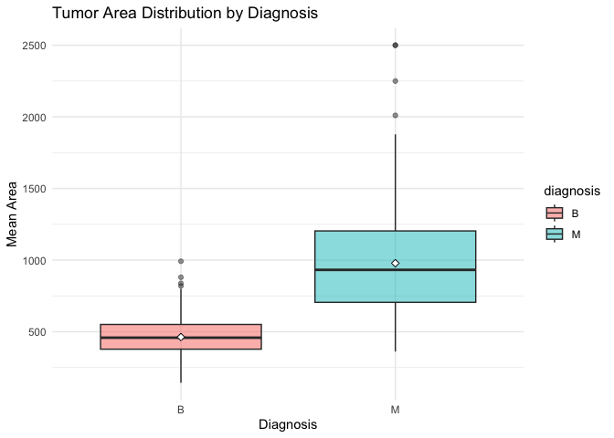
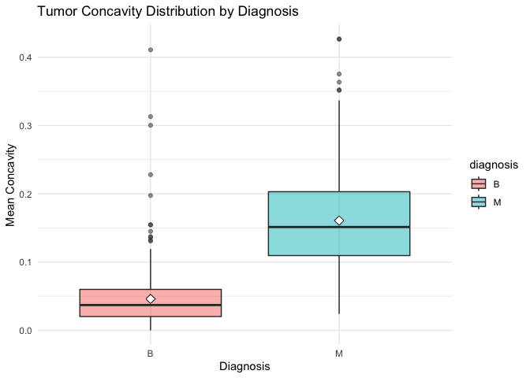
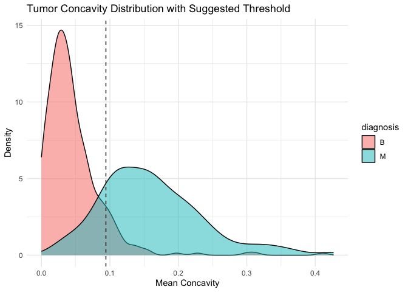
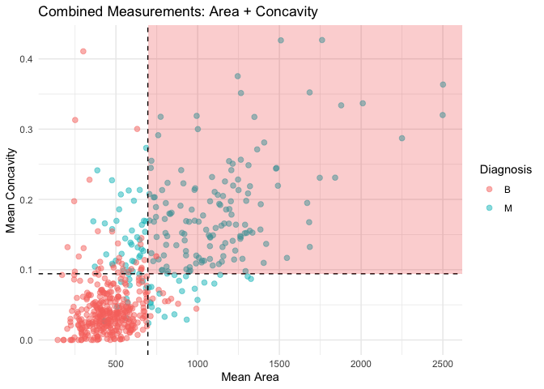
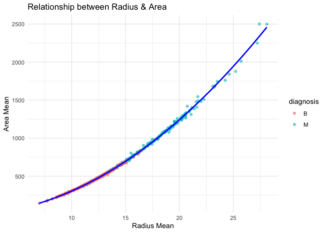

Mini Data Analysis Milestone 2
================

*To complete this milestone, you can edit [this `.rmd`
file](https://github.com/UBC-STAT/STAT545.github.io/blob/main/content/mini-data-analysis/mini-project-2.Rmd)
directly. Fill in the sections that are commented out with
`<!--- start your work here--->`. When you are done, make sure to knit
to an `.md` file by changing the output in the YAML header to
`github_document`, before submitting a tagged release on canvas.*

# Welcome to the rest of your mini data analysis project!

In Milestone 1, you explored your data. and came up with research
questions. This time, we will finish up our mini data analysis and
obtain results for your data by:

- Making summary tables and graphs
- Manipulating special data types in R: factors and/or dates and times.
- Fitting a model object to your data, and extract a result.
- Reading and writing data as separate files.

We will also explore more in depth the concept of *tidy data.*

**NOTE**: The main purpose of the mini data analysis is to integrate
what you learn in class in an analysis. Although each milestone provides
a framework for you to conduct your analysis, it’s possible that you
might find the instructions too rigid for your data set. If this is the
case, you may deviate from the instructions – just make sure you’re
demonstrating a wide range of tools and techniques taught in this class,
and indicate *why* you had to deviate. Feel free to contact the
instructor in these cases.

# Instructions

**To complete this milestone**, edit [this very `.Rmd`
file](https://github.com/UBC-STAT/STAT545.github.io/blob/main/content/mini-data-analysis/mini-project-2.Rmd)
directly. Fill in the sections that are tagged with
`<!--- start your work here--->`.

**To submit this milestone**, make sure to knit this `.Rmd` file to an
`.md` file by changing the YAML output settings from
`output: html_document` to `output: github_document`. Commit and push
all of your work to your mini-analysis GitHub repository, and tag a
release on GitHub. Then, submit a link to your tagged release on canvas.

**Points**: This milestone is worth 50 points: 45 for your analysis, and
5 for overall reproducibility, cleanliness, and coherence of the Github
submission.

**Research Questions**: In Milestone 1, you chose four research
questions to focus on. Wherever realistic, your work in this milestone
should relate to these research questions whenever we ask for
justification behind your work. In the case that some tasks in this
milestone don’t align well with one of your research questions, feel
free to discuss your results in the context of a different research
question.

# Learning Objectives

By the end of this milestone, you should:

- Understand what *tidy* data is, and how to create it using `tidyr`.
- Generate a reproducible and clear report using R Markdown.
- Manipulating special data types in R: factors and/or dates and times.
- Fitting a model object to your data, and extract a result.
- Reading and writing data as separate files.

# Setup

Begin by loading your data and the tidyverse package below:

``` r
library(datateachr) # <- might contain the data you picked!
library(tidyverse)
```

# Task 1: Process and summarize your data

From Milestone 1, you should have an idea of the basic structure of your
dataset (e.g. number of rows and columns, class types, etc.). Here, we
will start investigating your data more in-depth using various data
manipulation functions.

### 1.1 (1 point)

First, write out the 4 research questions you defined in milestone 1
were. This will guide your work through milestone 2:

<!-------------------------- Start your work below ---------------------------->

**RQ1**: Do malignant tumors have significantly larger measurements
(radius, area, perimeter) compared to benign tumors?

**RQ2**: Are certain shape characteristics (concavity, symmetry,
compactness) good indicators of tumor malignancy?

**RQ3**: What is the critical threshold value for concavity that best
separate malignant from benign tumors?

**RQ4**: Will combination of measurements always improve separation
between malignant and benign diagnoses?
<!----------------------------------------------------------------------------->

Here, we will investigate your data using various data manipulation and
graphing functions.

### 1.2 (8 points)

Now, for each of your four research questions, choose one task from
options 1-4 (summarizing), and one other task from 4-8 (graphing). You
should have 2 tasks done for each research question (8 total). Make sure
it makes sense to do them! (e.g. don’t use a numerical variables for a
task that needs a categorical variable.). Comment on why each task helps
(or doesn’t!) answer the corresponding research question.

Ensure that the output of each operation is printed!

Also make sure that you’re using dplyr and ggplot2 rather than base R.
Outside of this project, you may find that you prefer using base R
functions for certain tasks, and that’s just fine! But part of this
project is for you to practice the tools we learned in class, which is
dplyr and ggplot2.

**Summarizing:**

1.  Compute the *range*, *mean*, and *two other summary statistics* of
    **one numerical variable** across the groups of **one categorical
    variable** from your data.
2.  Compute the number of observations for at least one of your
    categorical variables. Do not use the function `table()`!
3.  Create a categorical variable with 3 or more groups from an existing
    numerical variable. You can use this new variable in the other
    tasks! *An example: age in years into “child, teen, adult, senior”.*
4.  Compute the proportion and counts in each category of one
    categorical variable across the groups of another categorical
    variable from your data. Do not use the function `table()`!

**Graphing:**

6.  Create a graph of your choosing, make one of the axes logarithmic,
    and format the axes labels so that they are “pretty” or easier to
    read.
7.  Make a graph where it makes sense to customize the alpha
    transparency.

Using variables and/or tables you made in one of the “Summarizing”
tasks:

8.  Create a graph that has at least two geom layers.
9.  Create 3 histograms, with each histogram having different sized
    bins. Pick the “best” one and explain why it is the best.

Make sure it’s clear what research question you are doing each operation
for!

<!------------------------- Start your work below ----------------------------->

``` r
# Test dataloader
glimpse(cancer_sample)
```

    ## Rows: 569
    ## Columns: 32
    ## $ ID                      <dbl> 842302, 842517, 84300903, 84348301, 84358402, …
    ## $ diagnosis               <chr> "M", "M", "M", "M", "M", "M", "M", "M", "M", "…
    ## $ radius_mean             <dbl> 17.990, 20.570, 19.690, 11.420, 20.290, 12.450…
    ## $ texture_mean            <dbl> 10.38, 17.77, 21.25, 20.38, 14.34, 15.70, 19.9…
    ## $ perimeter_mean          <dbl> 122.80, 132.90, 130.00, 77.58, 135.10, 82.57, …
    ## $ area_mean               <dbl> 1001.0, 1326.0, 1203.0, 386.1, 1297.0, 477.1, …
    ## $ smoothness_mean         <dbl> 0.11840, 0.08474, 0.10960, 0.14250, 0.10030, 0…
    ## $ compactness_mean        <dbl> 0.27760, 0.07864, 0.15990, 0.28390, 0.13280, 0…
    ## $ concavity_mean          <dbl> 0.30010, 0.08690, 0.19740, 0.24140, 0.19800, 0…
    ## $ concave_points_mean     <dbl> 0.14710, 0.07017, 0.12790, 0.10520, 0.10430, 0…
    ## $ symmetry_mean           <dbl> 0.2419, 0.1812, 0.2069, 0.2597, 0.1809, 0.2087…
    ## $ fractal_dimension_mean  <dbl> 0.07871, 0.05667, 0.05999, 0.09744, 0.05883, 0…
    ## $ radius_se               <dbl> 1.0950, 0.5435, 0.7456, 0.4956, 0.7572, 0.3345…
    ## $ texture_se              <dbl> 0.9053, 0.7339, 0.7869, 1.1560, 0.7813, 0.8902…
    ## $ perimeter_se            <dbl> 8.589, 3.398, 4.585, 3.445, 5.438, 2.217, 3.18…
    ## $ area_se                 <dbl> 153.40, 74.08, 94.03, 27.23, 94.44, 27.19, 53.…
    ## $ smoothness_se           <dbl> 0.006399, 0.005225, 0.006150, 0.009110, 0.0114…
    ## $ compactness_se          <dbl> 0.049040, 0.013080, 0.040060, 0.074580, 0.0246…
    ## $ concavity_se            <dbl> 0.05373, 0.01860, 0.03832, 0.05661, 0.05688, 0…
    ## $ concave_points_se       <dbl> 0.015870, 0.013400, 0.020580, 0.018670, 0.0188…
    ## $ symmetry_se             <dbl> 0.03003, 0.01389, 0.02250, 0.05963, 0.01756, 0…
    ## $ fractal_dimension_se    <dbl> 0.006193, 0.003532, 0.004571, 0.009208, 0.0051…
    ## $ radius_worst            <dbl> 25.38, 24.99, 23.57, 14.91, 22.54, 15.47, 22.8…
    ## $ texture_worst           <dbl> 17.33, 23.41, 25.53, 26.50, 16.67, 23.75, 27.6…
    ## $ perimeter_worst         <dbl> 184.60, 158.80, 152.50, 98.87, 152.20, 103.40,…
    ## $ area_worst              <dbl> 2019.0, 1956.0, 1709.0, 567.7, 1575.0, 741.6, …
    ## $ smoothness_worst        <dbl> 0.1622, 0.1238, 0.1444, 0.2098, 0.1374, 0.1791…
    ## $ compactness_worst       <dbl> 0.6656, 0.1866, 0.4245, 0.8663, 0.2050, 0.5249…
    ## $ concavity_worst         <dbl> 0.71190, 0.24160, 0.45040, 0.68690, 0.40000, 0…
    ## $ concave_points_worst    <dbl> 0.26540, 0.18600, 0.24300, 0.25750, 0.16250, 0…
    ## $ symmetry_worst          <dbl> 0.4601, 0.2750, 0.3613, 0.6638, 0.2364, 0.3985…
    ## $ fractal_dimension_worst <dbl> 0.11890, 0.08902, 0.08758, 0.17300, 0.07678, 0…

***RQ1***: Do malignant tumors have significantly larger measurements
(radius, area, perimeter) compared to benign tumors?

**Summarizing**

``` r
area_summary <- cancer_sample %>%
  group_by(diagnosis) %>%
  summarise(
    # Range
    range = max(area_mean) - min(area_mean),
    
    # Mean
    mean_area = mean(area_mean),
    
    # Median 
    median_area = median(area_mean),
    
    # Standard Deviation
    stdev_area = sd(area_mean),
    
    # Count of observations
    n = n()
  )

print(area_summary)
```

    ## # A tibble: 2 × 6
    ##   diagnosis range mean_area median_area stdev_area     n
    ##   <chr>     <dbl>     <dbl>       <dbl>      <dbl> <int>
    ## 1 B          849.      463.        458.       134.   357
    ## 2 M         2139.      978.        932        368.   212

We choose summarizing option 1 to compute the *range*, *mean*, *median*,
and *standard deviation* of **area_mean** across the groups of cancer
**diagnosis**. This choice directly addresses RQ1, and we summarized
area_mean by diagnosis because tumor area is a fundamental size
measurement that already integrates radius and perimeter information.

**Graphing**

``` r
ggplot(cancer_sample, aes(x = diagnosis, y = area_mean, fill = diagnosis)) +
  geom_boxplot(alpha = 0.5) +
  stat_summary(fun = mean, geom = "point", shape = 23, size = 2, fill = "white") +
  labs(title = "Tumor Area Distribution by Diagnosis",
       x = "Diagnosis",
       y = "Mean Area") +
  theme_minimal()
```

<!-- --> We
choose graphing option 7 to make a graph where it makes sense to
customize the alpha transparency. We use a boxplot to visualize the
distribution of area_mean across diagnosis groups, which is aligned with
our previous *summarizing* part. The plot shows range, median,
quantiles, and outliers for both groups, and we adjusted transparency to
enhance the visual clarity of mean and quantiles. From the plot, we can
tell malignant tumors do tend to have larger measurements compared to
benign tumors.

***RQ2***: Are certain shape characteristics (concavity, symmetry,
compactness) good indicators of tumor malignancy?

**Summarizing**

``` r
concavity_summary <- cancer_sample %>%
  group_by(diagnosis) %>%
  summarise(
    # Range
    range = max(concavity_mean) - min(concavity_mean),
    
    # Mean
    mean_concavity = mean(concavity_mean),
    
    # Standard deviation
    sd_concavity = sd(concavity_mean),
    
    # Coefficient of variation
    cv_concavity = (sd_concavity / mean_concavity) * 100,
    
    # Count of observations
    n = n()
  )

print(concavity_summary)
```

    ## # A tibble: 2 × 6
    ##   diagnosis range mean_concavity sd_concavity cv_concavity     n
    ##   <chr>     <dbl>          <dbl>        <dbl>        <dbl> <int>
    ## 1 B         0.411         0.0461       0.0434         94.3   357
    ## 2 M         0.403         0.161        0.0750         46.7   212

We choose summarizing option 1 to compute the *range*, *mean*, *standard
deviation*, and *coefficient of variation* of **concavity_mean** across
the groups of cancer **diagnosis**. Specifically, we choose concavity
since it’s a pure shape characteristic that is independent of size. We
also added coefficient of variation of concavity to show how
consistently concavity can be used to predict diagnosis.

**Graphing**

``` r
ggplot(cancer_sample, aes(x = diagnosis, y = concavity_mean, fill = diagnosis)) +
  geom_boxplot(alpha = 0.5) +
  stat_summary(fun = mean, geom = "point", shape = 23, size = 3, fill = "white") +
  labs(title = "Tumor Concavity Distribution by Diagnosis",
       x = "Diagnosis",
       y = "Mean Concavity") +
  theme_minimal()
```

<!-- -->

We choose graphing option 7 to make a graph where it makes sense to
customize the alpha transparency. Same as RQ1, we use a boxplot to
visualize the distribution of concavity_mean across diagnosis groups. We
adjusted transparency to enhance the visual clarity of mean and
quantiles. By using the same visualization approach as in RQ1, we can
tell concavity is also a good indicator of tumor malignancy.

**RQ3**: What is the critical threshold value for concavity that best
separate malignant from benign tumors?

**Summarizing**

``` r
# Calculate threshold first
concavity_threshold <- cancer_sample %>%
  group_by(diagnosis) %>%
  summarise(median_val = median(concavity_mean)) %>%
  summarise(threshold = mean(median_val)) %>%
  pull(threshold)

# Create summary with threshold-based classification
concavity_threshold_summary <- cancer_sample %>%
  mutate(
    # Classify based on threshold
    predicted_class = ifelse(concavity_mean < concavity_threshold, 
                             "Below Threshold (Likely Benign)", 
                             "Above Threshold (Likely Malignant)")
  ) %>%
  count(predicted_class, diagnosis) %>%
  group_by(predicted_class) %>%
  mutate(
    total = sum(n), # Result of count() is 'n', not 'count'!
    percentage = round((n / total) * 100, 2)
  )

print(concavity_threshold_summary)
```

    ## # A tibble: 4 × 5
    ## # Groups:   predicted_class [2]
    ##   predicted_class                    diagnosis     n total percentage
    ##   <chr>                              <chr>     <int> <int>      <dbl>
    ## 1 Above Threshold (Likely Malignant) B            33   211       15.6
    ## 2 Above Threshold (Likely Malignant) M           178   211       84.4
    ## 3 Below Threshold (Likely Benign)    B           324   358       90.5
    ## 4 Below Threshold (Likely Benign)    M            34   358        9.5

We choose summarizing option 2 to compute the number of observations
among threshold-based concavity categories for each diagnosis group. We
choose concavity_mean as a representative to identify the best threshold
for separating malignant from benign tumors. Moreover, we propose to use
the average of median concavity of each diagnosis group as the
threshold.

**Graphing**

``` r
# Density plot with threshold
ggplot(cancer_sample, aes(x = concavity_mean, fill = diagnosis)) +
  # Layer 1: Density curves
  geom_density(alpha = 0.5) +
  # Layer 2: Vertical threshold line
  geom_vline(xintercept = concavity_threshold, 
             linetype = "dashed") +
  labs(title = "Tumor Concavity Distribution with Suggested Threshold",
       x = "Mean Concavity",
       y = "Density") +
  theme_minimal()
```

<!-- --> We
choose graphing option 8 to create a graph that has at least two geom
layers. We use the density plot as the first layer shows the
distribution of concavity for both tumor types, with the vertical line
as a second layer indicating the threshold value we computed in
summarizing part.

**RQ4**: Will combination of measurements always improve separation
between malignant and benign diagnoses?

**Summarizing**

``` r
# Calculate thresholds following previous RQs
area_threshold <- cancer_sample %>%
  group_by(diagnosis) %>%
  summarise(median_val = median(area_mean)) %>%
  summarise(threshold = mean(median_val)) %>%
  pull(threshold)

concavity_threshold <- cancer_sample %>%
  group_by(diagnosis) %>%
  summarise(median_val = median(concavity_mean)) %>%
  summarise(threshold = mean(median_val)) %>%
  pull(threshold)

cat("Calculated Thresholds:\n")
```

    ## Calculated Thresholds:

``` r
cat("Area:", round(area_threshold, 2), "\n")
```

    ## Area: 695.2

``` r
cat("Concavity:", round(concavity_threshold, 2), "\n\n")
```

    ## Concavity: 0.09

``` r
# Use these thresholds to compare prediction accuracy
accuracy_summary <- bind_rows(
  # Area only
  cancer_sample %>%
    mutate(correct = (area_mean >= area_threshold & diagnosis == "M") | 
                     (area_mean < area_threshold & diagnosis == "B")) %>%
    summarise(Method = "Area Only",
              Threshold = paste(round(area_threshold, 2)),
              Accuracy = round(mean(correct) * 100, 2)),
  
  # Concavity only
  cancer_sample %>%
    mutate(correct = (concavity_mean >= concavity_threshold & diagnosis == "M") | 
                     (concavity_mean < concavity_threshold & diagnosis == "B")) %>%
    summarise(Method = "Concavity Only",
              Threshold = as.character(round(concavity_threshold, 2)),
              Accuracy = round(mean(correct) * 100, 2)),
  
  # Combined
  cancer_sample %>%
    mutate(
      predicted = ifelse(area_mean <= area_threshold & concavity_mean <= concavity_threshold, "B", "M"),
      correct = (predicted == diagnosis)
    ) %>%
    summarise(Method = "Combined (Area + Concavity)",
              Threshold = "Both",
              Accuracy = round(mean(correct) * 100, 2))
)

print(accuracy_summary)
```

    ## # A tibble: 3 × 3
    ##   Method                      Threshold Accuracy
    ##   <chr>                       <chr>        <dbl>
    ## 1 Area Only                   695.2         89.5
    ## 2 Concavity Only              0.09          88.2
    ## 3 Combined (Area + Concavity) Both          90.5

We choose summarizing option 1&2. First, we compute the *range*, *mean*,
*median*, and *standard deviation* of **area_mean** and
**concavity_mean** across the groups of cancer **diagnosis** like in RQ1
and RQ2. Then we use the median values to compute the categorization
threshold like in RQ3, and compute prediction accuracy using three types
of thresholds: area, concavity, and combining area and concavity. From
the summary, it is clear that using both area and concavity can improve
the prediction accuracy.

**Graphing**

``` r
ggplot(cancer_sample, aes(x = area_mean, y = concavity_mean, color = diagnosis)) +
  # Layer 1: Points
  geom_point(alpha = 0.5, size = 2) +
  # Layer 2: Reference lines and shaded regions
  geom_vline(xintercept = area_threshold, linetype = "dashed") +
  geom_hline(yintercept = concavity_threshold, linetype = "dashed") +
  # Add shaded region for high-confidence malignant
  annotate("rect", xmin = area_threshold, xmax = Inf, 
           ymin = concavity_threshold, ymax = Inf,
           alpha = 0.2, fill = "red2") +
  labs(title = "Combined Measurements: Area + Concavity",
       x = "Mean Area",
       y = "Mean Concavity",
       color = "Diagnosis") +
  theme_minimal()
```

<!-- --> We
choose graphing option 8 to create a graph that has at least two geom
layers using the thresholds we calculated. The graph clearly illustrates
that combining the thresholds increases prediction accuracy compared to
using either threshold independently.

<!----------------------------------------------------------------------------->

### 1.3 (2 points)

Based on the operations that you’ve completed, how much closer are you
to answering your research questions? Think about what aspects of your
research questions remain unclear. Can your research questions be
refined, now that you’ve investigated your data a bit more? Which
research questions are yielding interesting results?

<!------------------------- Write your answer here ---------------------------->

The summarizing and graphing steps have helped address several of my
research questions. I have simplified some RQs from milestone 1 to make
them more manageable. Particularly, RQ4 yields interesting results,
demonstrating that using multiple variables improves prediction
accuracy. This finding validates the importance of a multivariate
approach to classification. On the other hand, RQ3, which explores
threshold choices, has room for further investigation. Future work could
examine more complex thresholds rather than solely relying on constant
threshold values.
<!----------------------------------------------------------------------------->

# Task 2: Tidy your data

In this task, we will do several exercises to reshape our data. The goal
here is to understand how to do this reshaping with the `tidyr` package.

A reminder of the definition of *tidy* data:

- Each row is an **observation**
- Each column is a **variable**
- Each cell is a **value**

### 2.1 (2 points)

Based on the definition above, can you identify if your data is tidy or
untidy? Go through all your columns, or if you have \>8 variables, just
pick 8, and explain whether the data is untidy or tidy.

<!--------------------------- Start your work below --------------------------->

``` r
# Criterion 1: Each row is a observation
# Check if each row represents a unique tumor sample
cancer_sample %>%
  summarise(
    n_rows = n(),
    n_unique_ids = n_distinct(ID),
    each_row_unique = n_rows == n_unique_ids
  )
```

    ## # A tibble: 1 × 3
    ##   n_rows n_unique_ids each_row_unique
    ##    <int>        <int> <lgl>          
    ## 1    569          569 TRUE

``` r
# Verify each column represents ONE variable
cancer_sample %>%
  summarise(
    has_ID = "ID" %in% names(.),
    has_diagnosis = "diagnosis" %in% names(.),
    has_measurements = any(str_detect(names(.), "mean|se|worst"))
  )
```

    ## # A tibble: 1 × 3
    ##   has_ID has_diagnosis has_measurements
    ##   <lgl>  <lgl>         <lgl>           
    ## 1 TRUE   TRUE          TRUE

``` r
# Criterion 3: Each cell is a value
# Check that cells contain single values (not multiple values or lists)
cancer_sample %>%
  summarise(
    all_atomic = all(sapply(., is.atomic)),  # Not lists
    no_list_columns = !any(sapply(., is.list))
  )
```

    ## # A tibble: 1 × 2
    ##   all_atomic no_list_columns
    ##   <lgl>      <lgl>          
    ## 1 TRUE       TRUE

Therefore, all three criteria are satisfied, the cancer_sample dataset
is clean.
<!----------------------------------------------------------------------------->

### 2.2 (4 points)

Now, if your data is tidy, untidy it! Then, tidy it back to it’s
original state.

If your data is untidy, then tidy it! Then, untidy it back to it’s
original state.

Be sure to explain your reasoning for this task. Show us the “before”
and “after”.

<!--------------------------- Start your work below --------------------------->

**Before tidying**

``` r
# Untidy version: Make it longer (violates one observation per row)
cancer_untidy <- cancer_sample %>%
  pivot_longer(
    cols = radius_mean:fractal_dimension_worst,
    names_to = "measurement",
    values_to = "value"
  )

glimpse(cancer_untidy)
```

    ## Rows: 17,070
    ## Columns: 4
    ## $ ID          <dbl> 842302, 842302, 842302, 842302, 842302, 842302, 842302, 84…
    ## $ diagnosis   <chr> "M", "M", "M", "M", "M", "M", "M", "M", "M", "M", "M", "M"…
    ## $ measurement <chr> "radius_mean", "texture_mean", "perimeter_mean", "area_mea…
    ## $ value       <dbl> 1.799e+01, 1.038e+01, 1.228e+02, 1.001e+03, 1.184e-01, 2.7…

**After tidying**

``` r
# Tidy back the dataset
cancer_tidy <- cancer_untidy %>%
  pivot_wider(
    names_from = measurement,
    values_from = value
  )
# Verify it matches the original
all.equal(cancer_sample, cancer_tidy, check.attributes = FALSE)
```

    ## [1] TRUE

<!----------------------------------------------------------------------------->

### 2.3 (4 points)

Now, you should be more familiar with your data, and also have made
progress in answering your research questions. Based on your interest,
and your analyses, pick 2 of the 4 research questions to continue your
analysis in the remaining tasks:

<!-------------------------- Start your work below ---------------------------->

1.  **RQ3**: What is the critical threshold value for concavity that
    best separate malignant from benign tumors?
2.  **RQ4**: Will combination of measurements always improve separation
    between malignant and benign diagnoses?

<!----------------------------------------------------------------------------->

Explain your decision for choosing the above two research questions.

<!--------------------------- Start your work below --------------------------->

I selected RQ3 and RQ4 because they directly relates to tumor diagnosis.
RQ3 aims to find the optimal cutoff for a single measurement, while RQ4
investigates whether combining features improves separation between
malignant and benign tumors. These questions are complementary and may
have practical impact on developing diagnostic criteria.
<!----------------------------------------------------------------------------->

Now, try to choose a version of your data that you think will be
appropriate to answer these 2 questions. Use between 4 and 8 functions
that we’ve covered so far (i.e. by filtering, cleaning, tidy’ing,
dropping irrelevant columns, etc.).

*If your data is already as tidy as it can be, just explain why the
dataset is appropriate and you’ll receive full marks. you can ignore the
4 - 8 functions requirements.* (Added according to slack announcement).

(If it makes more sense, then you can make/pick two versions of your
data, one for each research question.)

<!--------------------------- Start your work below --------------------------->

The dataset is already tidy enough, as is shown in our analyses in 2.1.
Each row represents a single tumor observation with a unique ID, each
column represents a distinct variable (categorical diagnosis or
numerical measurement), and each cell contains a single atomic value.
For RQ3 and RQ4, I may use the diagnosis and some measurements
(concavity_mean, radius_mean, etc.), all of which are already present
with no missing values.

<!----------------------------------------------------------------------------->

# Task 3: Modelling

## 3.0 (no points)

Pick a research question from 1.2, and pick a variable of interest
(we’ll call it “Y”) that’s relevant to the research question. Indicate
these.

<!-------------------------- Start your work below ---------------------------->

**Research Question**: Do malignant tumors have significantly larger
measurements (radius, area, perimeter) compared to benign tumors? (RQ1)

**Variable of interest**: area_mean and radius_mean. The radius should
be capable of representing area to some extent, so we plan to
investigate the relationship between them.

<!----------------------------------------------------------------------------->

## 3.1 (3 points)

Fit a model or run a hypothesis test that provides insight on this
variable with respect to the research question. Store the model object
as a variable, and print its output to screen. We’ll omit having to
justify your choice, because we don’t expect you to know about model
specifics in STAT 545.

- **Note**: It’s OK if you don’t know how these models/tests work. Here
  are some examples of things you can do here, but the sky’s the limit.

  - You could fit a model that makes predictions on Y using another
    variable, by using the `lm()` function.
  - You could test whether the mean of Y equals 0 using `t.test()`, or
    maybe the mean across two groups are different using `t.test()`, or
    maybe the mean across multiple groups are different using `anova()`
    (you may have to pivot your data for the latter two).
  - You could use `lm()` to test for significance of regression
    coefficients.

<!-------------------------- Start your work below ---------------------------->

Intuitively, the tumor should have a circular/elliptical shape, so we
will try to fit a quadratic function.

``` r
# Fit a second-order polynomial regression model to predict area_mean from radius_mean
# Predicting area_mean from radius_mean and radius_mean^2
model <- lm(area_mean ~ radius_mean + I(radius_mean^2), data = cancer_sample)

# Print the model output
print(summary(model))
```

    ## 
    ## Call:
    ## lm(formula = area_mean ~ radius_mean + I(radius_mean^2), data = cancer_sample)
    ## 
    ## Residuals:
    ##      Min       1Q   Median       3Q      Max 
    ## -100.564   -3.285    0.161    3.540  161.321 
    ## 
    ## Coefficients:
    ##                   Estimate Std. Error t value Pr(>|t|)    
    ## (Intercept)      -10.51640    8.74880  -1.202    0.230    
    ## radius_mean        0.43685    1.14249   0.382    0.702    
    ## I(radius_mean^2)   3.10993    0.03577  86.952   <2e-16 ***
    ## ---
    ## Signif. codes:  0 '***' 0.001 '**' 0.01 '*' 0.05 '.' 0.1 ' ' 1
    ## 
    ## Residual standard error: 14.75 on 566 degrees of freedom
    ## Multiple R-squared:  0.9983, Adjusted R-squared:  0.9982 
    ## F-statistic: 1.614e+05 on 2 and 566 DF,  p-value: < 2.2e-16

<!----------------------------------------------------------------------------->

## 3.2 (3 points)

Produce something relevant from your fitted model: either predictions on
Y, or a single value like a regression coefficient or a p-value.

- Be sure to indicate in writing what you chose to produce.
- Your code should either output a tibble (in which case you should
  indicate the column that contains the thing you’re looking for), or
  the thing you’re looking for itself.
- Obtain your results using the `broom` package if possible. If your
  model is not compatible with the broom function you’re needing, then
  you can obtain your results by some other means, but first indicate
  which broom function is not compatible.

<!-------------------------- Start your work below ---------------------------->

``` r
library(broom)
# Get the regression coefficients
model_results <- tidy(model)
print(model_results)
```

    ## # A tibble: 3 × 5
    ##   term             estimate std.error statistic p.value
    ##   <chr>               <dbl>     <dbl>     <dbl>   <dbl>
    ## 1 (Intercept)       -10.5      8.75      -1.20    0.230
    ## 2 radius_mean         0.437    1.14       0.382   0.702
    ## 3 I(radius_mean^2)    3.11     0.0358    87.0     0

``` r
# This will show three coefficients:
# - (Intercept): constant intercept
# - radius_mean: linear coefficient
# - I(radius_mean^2): 2nd-order coefficient
```

The visualization shows our fitted quadratic model. The strong fit
validates our assumption, i.e. there is a quadratic relationship between
radius and area. This high correlation suggests these two measurements
may provide largely redundant information.

``` r
# Visualize the quadratic function
ggplot(cancer_sample, aes(x = radius_mean, y = area_mean)) +
  geom_point(aes(color = diagnosis), alpha = 0.6) +
  geom_smooth(method = "lm", formula = y ~ x + I(x^2), 
              se = TRUE, color = "blue") +
  labs(title = "Relationship between Radius & Area",
       x = "Radius Mean",
       y = "Area Mean") +
  theme_minimal()
```

<!-- -->

<!----------------------------------------------------------------------------->

# Task 4: Reading and writing data

Get set up for this exercise by making a folder called `output` in the
top level of your project folder / repository. You’ll be saving things
there.

## 4.1 (3 points)

Take a summary table that you made from Task 1, and write it as a csv
file in your `output` folder. Use the `here::here()` function.

- **Robustness criteria**: You should be able to move your Mini Project
  repository / project folder to some other location on your computer,
  or move this very Rmd file to another location within your project
  repository / folder, and your code should still work.
- **Reproducibility criteria**: You should be able to delete the csv
  file, and remake it simply by knitting this Rmd file.

<!-------------------------- Start your work below ---------------------------->

``` r
# Create output folder if it doesn't exist
library(here)
```

    ## here() starts at /Users/juntaicao/Documents/GitHub/mini-data-analysis-juntaic7

``` r
dir.create(here("output"), showWarnings = FALSE)

# Write the summary table to CSV
write_csv(area_summary, here("output", "area_summary_table.csv"))
```

Next, we verify the file we saved by checking it’s existence and
contents.

``` r
# Check if file exists
file.exists(here("output", "area_summary_table.csv"))
```

    ## [1] TRUE

``` r
# Read it back to verify the contents
library(readr)
read_csv(here("output", "area_summary_table.csv"))
```

    ## Rows: 2 Columns: 6
    ## ── Column specification ────────────────────────────────────────────────────────
    ## Delimiter: ","
    ## chr (1): diagnosis
    ## dbl (5): range, mean_area, median_area, stdev_area, n
    ## 
    ## ℹ Use `spec()` to retrieve the full column specification for this data.
    ## ℹ Specify the column types or set `show_col_types = FALSE` to quiet this message.

    ## # A tibble: 2 × 6
    ##   diagnosis range mean_area median_area stdev_area     n
    ##   <chr>     <dbl>     <dbl>       <dbl>      <dbl> <dbl>
    ## 1 B          849.      463.        458.       134.   357
    ## 2 M         2139.      978.        932        368.   212

<!----------------------------------------------------------------------------->

## 4.2 (3 points)

Write your model object from Task 3 to an R binary file (an RDS), and
load it again. Be sure to save the binary file in your `output` folder.
Use the functions `saveRDS()` and `readRDS()`.

- The same robustness and reproducibility criteria as in 4.1 apply here.

<!-------------------------- Start your work below ---------------------------->

``` r
# Save& load back the model object to output folder
saveRDS(model, file = here("output", "area_radius_model.rds"))
loaded_model <- readRDS(here("output", "area_radius_model.rds"))

# Verify it loaded correctly by printing the summary
print(summary(loaded_model))
```

    ## 
    ## Call:
    ## lm(formula = area_mean ~ radius_mean + I(radius_mean^2), data = cancer_sample)
    ## 
    ## Residuals:
    ##      Min       1Q   Median       3Q      Max 
    ## -100.564   -3.285    0.161    3.540  161.321 
    ## 
    ## Coefficients:
    ##                   Estimate Std. Error t value Pr(>|t|)    
    ## (Intercept)      -10.51640    8.74880  -1.202    0.230    
    ## radius_mean        0.43685    1.14249   0.382    0.702    
    ## I(radius_mean^2)   3.10993    0.03577  86.952   <2e-16 ***
    ## ---
    ## Signif. codes:  0 '***' 0.001 '**' 0.01 '*' 0.05 '.' 0.1 ' ' 1
    ## 
    ## Residual standard error: 14.75 on 566 degrees of freedom
    ## Multiple R-squared:  0.9983, Adjusted R-squared:  0.9982 
    ## F-statistic: 1.614e+05 on 2 and 566 DF,  p-value: < 2.2e-16

``` r
# Check if the loaded model is identical to the original
identical(model, loaded_model)
```

    ## [1] TRUE

<!----------------------------------------------------------------------------->

# Overall Reproducibility/Cleanliness/Coherence Checklist

Here are the criteria we’re looking for.

## Coherence (0.5 points)

The document should read sensibly from top to bottom, with no major
continuity errors.

The README file should still satisfy the criteria from the last
milestone, i.e. it has been updated to match the changes to the
repository made in this milestone.

## File and folder structure (1 points)

You should have at least three folders in the top level of your
repository: one for each milestone, and one output folder. If there are
any other folders, these are explained in the main README.

Each milestone document is contained in its respective folder, and
nowhere else.

Every level-1 folder (that is, the ones stored in the top level, like
“Milestone1” and “output”) has a `README` file, explaining in a sentence
or two what is in the folder, in plain language (it’s enough to say
something like “This folder contains the source for Milestone 1”).

## Output (1 point)

All output is recent and relevant:

- All Rmd files have been `knit`ted to their output md files.
- All knitted md files are viewable without errors on Github. Examples
  of errors: Missing plots, “Sorry about that, but we can’t show files
  that are this big right now” messages, error messages from broken R
  code
- All of these output files are up-to-date – that is, they haven’t
  fallen behind after the source (Rmd) files have been updated.
- There should be no relic output files. For example, if you were
  knitting an Rmd to html, but then changed the output to be only a
  markdown file, then the html file is a relic and should be deleted.

Our recommendation: delete all output files, and re-knit each
milestone’s Rmd file, so that everything is up to date and relevant.

## Tagged release (0.5 point)

You’ve tagged a release for Milestone 2.
